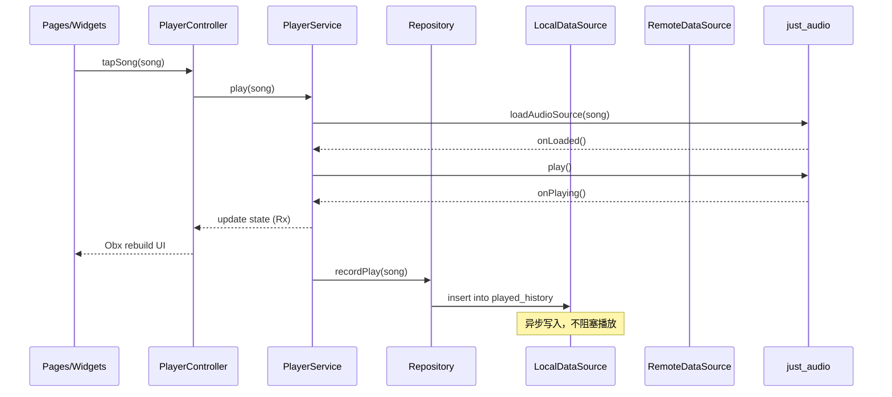
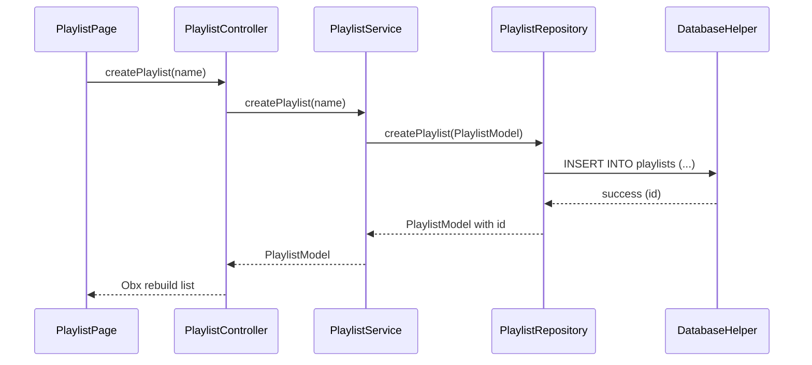
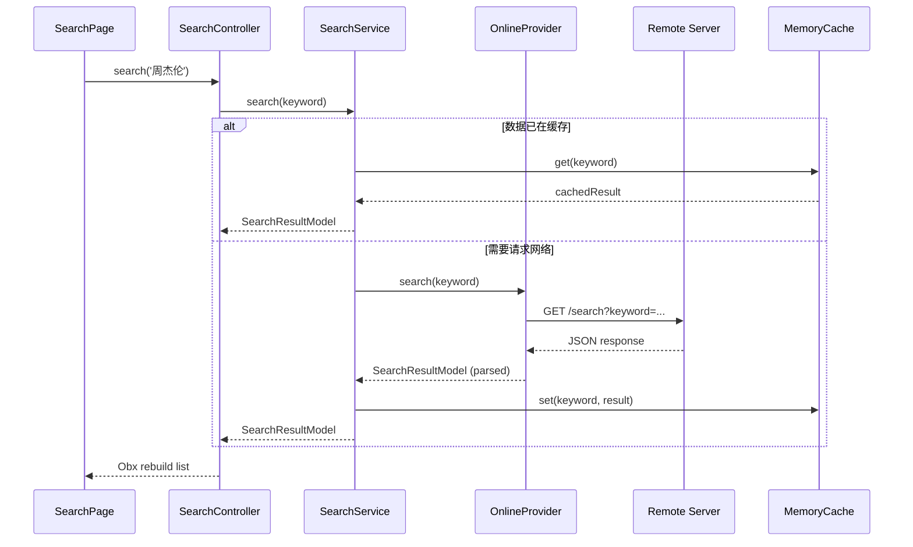

# Vexfy 数据流文档

本文档描述核心业务场景的数据流动路径。

---

## 1. 播放一首歌（Play a Song）

### 场景说明

用户点击一首歌曲触发播放，数据流从 UI → Controller → Service → DataSource → Player。

### 数据流图（Mermaid）



### 详细步骤

```
1. 用户点击歌曲
   └── PlayerController.play(Song song)

2. 根据歌曲来源判断数据获取方式
   ├── 本地歌曲：song.filePath 已存在，直接播放
   └── 在线歌曲：通过 song.id 调用 OnlineService.getSongUrl() 获取在线 URL

3. PlayerService 调用 just_audio 加载音频源
   └── await audioPlayer.setUrl(onlineUrl) 或 await audioPlayer.setFilePath(filePath)

4. 开始播放
   └── audioPlayer.play()

5. 通知 UI 状态更新
   ├── Rx<Song?> currentSong
   ├── Rx<PlayerState> playerState
   └── Rx<Duration> position

6. 异步记录播放历史（不阻塞播放）
   └── PlaylistService.recordPlay(song) → DatabaseHelper.insert('played_history', ...)

7. 如果有歌词，加载歌词
   └── LrcModel.parse(lyricsText) → 供 UI 实时滚动
```

### 代码路径

```
lib/app/modules/player/
├── player_controller.dart    # play() 方法入口
lib/app/services/
├── player_service.dart        # 播放器核心逻辑
lib/app/data/repositories/
├── song_repository.dart       # 播放历史记录
```

---

## 2. 创建歌单（Create Playlist）

### 场景说明

用户在本地创建新歌单，数据流经过 UI → Controller → Service → Repository → SQLite。

### 数据流图（Mermaid）



### 详细步骤

```
1. 用户输入歌单名，点击创建
   └── PlaylistController.createPlaylist('我的新歌单')

2. 生成歌单 ID（UUID）
   └── final id =Uuid().v4();

3. 构建 PlaylistModel
   └── PlaylistModel(id: id, name: name, type: PlaylistType.userCreated, ...)

4. 调用 Repository 写入数据库
   └── await PlaylistRepository.createPlaylist(model)
       └── INSERT INTO playlists (id, name, ...) VALUES (?, ?, ...)

5. 更新本地歌单列表（RxList）
   └── controller.playlists.add(newPlaylist)

6. UI 自动刷新（Obx / GetBuilder）
```

### 代码路径

```
lib/app/modules/playlist/
├── playlist_controller.dart   # createPlaylist() 方法
lib/app/services/
├── playlist_service.dart     # 业务逻辑封装
lib/app/data/repositories/
├── playlist_repository.dart   # 数据库写操作
lib/app/data/database/
├── database_helper.dart      # sqflite 操作封装
```

### 数据库写入 SQL

```sql
INSERT INTO playlists (id, name, cover_url, description, creator, type, song_count, created_at, updated_at)
VALUES (?, ?, ?, ?, ?, ?, 0, ?, ?);
```

---

## 3. 搜索歌曲（Search Songs）

### 场景说明

用户在搜索框输入关键词，从在线 API 获取搜索结果并展示。

### 数据流图（Mermaid）



### 详细步骤

```
1. 用户输入关键词并确认搜索
   └── SearchController.search('周杰伦')

2. 防抖处理（300ms）
   └── debounce timer，避免频繁请求

3. 检查内存缓存
   ├── 命中缓存：直接返回结果，渲染 UI
   └── 缓存未命中：继续下一步

4. 调用 OnlineService.search()
   └── GET /search?keyword=周杰伦&type=song&page=1

5. OnlineProvider 发起网络请求（dio）
   └── dio.get('/search', queryParameters: {...})

6. 解析 JSON 响应
   └── SearchResultModel.fromJson(response.data)

7. 写入缓存（有效期 5 分钟）
   └── MemoryCache.set('search:周杰伦', result, expiry: 5min)

8. 更新 Controller 状态
   ├── RxList<SongModel> searchResults
   └── RxBool isLoading

9. UI 响应式渲染（Obx）
```

### 缓存策略

| 缓存层 | 介质 | 生命周期 | 说明 |
|--------|------|----------|------|
| 内存缓存 | `HashMap<String, SearchResult>` | 5 分钟 | 搜索结果缓存 |
| 磁盘缓存 | `path_provider` 目录下的 json 文件 | 30 分钟 | 离线搜索可用（可选） |

### 请求参数

```
GET /search?keyword=周杰伦&type=all&page=1&pageSize=20
```

### 响应解析

```dart
final result = SearchResultModel.fromJson(response['data']);
// 赋值给 RxList
searchResults.assignAll(result.songs);
```

---

## 4. 数据流关键原则

### 4.1 单向数据流

- **UI 触发 Action** → Controller 接收
- **Controller 调用 Service** → 处理业务逻辑
- **Service 调用 Repository** → 访问数据
- **数据逐层向上返回** → UI 响应式更新

### 4.2 同步 vs 异步

| 操作 | 同步/异步 | 说明 |
|------|-----------|------|
| 播放控制 | 同步 | 必须立即响应用户操作 |
| 播放历史记录 | 异步 | 不阻塞播放，可延迟写入 |
| UI 状态更新 | 同步（响应式） | GetX Obx 自动同步 |
| 数据库读写 | 异步 | 所有 IO 操作均为 async |

### 4.3 错误处理

```
Service 层捕获异常
├── 网络错误：返回空列表 + isError flag
├── 数据库错误：记录日志 + 返回空数据
└── 播放器错误：通知 Controller 更新 playerState 为 error
```

### 4.4 依赖方向

```
UI → Controller → Service → Repository → DataSource
                         ↓
                    just_audio（播放器）
                    sqflite（本地DB）
                    dio（网络）
```

禁止反向依赖：DataSource 不能引用 Controller，Service 不能直接操作 UI。