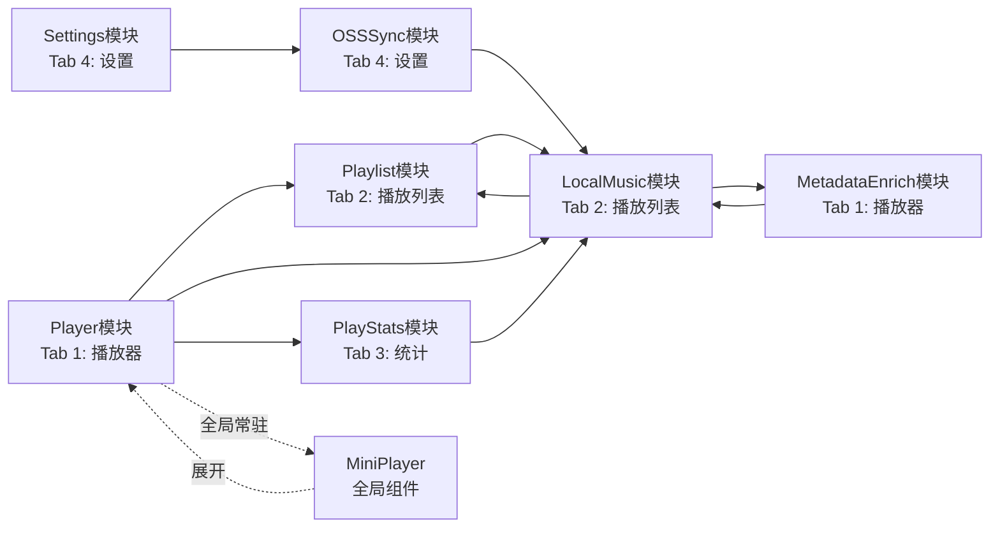

# Vexfy 模块设计文档

## 1. 模块划分概览

```
lib/
├── app/
│   ├── modules/            # 功能模块（按业务划分）
│   │   ├── player/         # 播放器模块（对应 Tab 1：播放器）
│   │   ├── local_music/    # 本地音乐模块（对应 Tab 2：播放列表）
│   │   ├── playlist/        # 歌单模块（对应 Tab 2：播放列表）
│   │   ├── stats/          # 统计模块（对应 Tab 3：统计）
│   │   ├── settings/       # 设置模块（对应 Tab 4：设置）
│   │   └── oss_sync/       # OSS双向同步模块（对应 Tab 4：设置）
│   ├── services/          # 跨模块公共服务
│   ├── data/              # 数据层（providers / models / repositories）
│   ├── routes/            # 路由配置
│   └── core/              # 核心常量、工具类、主题
│
├── Global Components（全局组件，非独立模块）
│   ├── mini_player/       # 迷你播放器（全 Tab 常驻）
│   └── notification_player/ # 通知栏播放器（后台播放）
```

### 1.1 Tab 与模块对应关系

| Tab | 页面 | 对应模块 |
|-----|------|----------|
| Tab 1 | **播放器**（PlayerPage） | PlayerModule（播放控制、歌词、封面、后台播放） |
| Tab 2 | **播放列表**（PlaylistPage） | LocalMusicModule（本地扫描）+ PlaylistModule（歌单管理） |
| Tab 3 | **统计**（StatsPage） | StatsModule（播放统计、分类统计、时段统计） |
| Tab 4 | **设置**（SettingsPage） | SettingsModule（配置）+ OSSSyncModule（OSS同步配置） |

> **全局组件**：MiniPlayer 在所有 Tab 间常驻，点击展开全屏 PlayerPage。

## 2. 各模块职责

### 2.1 Player 模块

**职责**：音频播放控制、播放队列管理、播放模式切换、歌词同步。

**Controller**：`PlayerController`
**Service**：`PlayerService`

**对外接口**：
- `play(Song song)` — 播放指定歌曲
- `pause()` / `resume()` — 暂停/继续
- `stop()` — 停止播放
- `seekTo(Duration position)` — 跳转
- `addToQueue(Song song)` — 添加到播放队列
- `setPlayMode(PlayMode mode)` — 设置播放模式（单曲/列表/随机）
- `getCurrentLrc()` — 获取当前时间歌词

### 2.2 LocalMusic 模块

**职责**：扫描设备音乐文件、显示本地歌曲列表、收藏/取消收藏。

**Controller**：`LocalMusicController`
**Service**：`MusicScannerService`

**对外接口**：
- `scanLocalMusic()` — 扫描本地音乐
- `getLocalSongs({String? sortBy})` — 获取本地歌曲列表
- `favorite(Song song)` / `unfavorite(Song song)` — 收藏/取消收藏
- `getFavoriteSongs()` — 获取收藏列表

### 2.3 OSSSync 模块

**职责**：本地音乐与阿里云 OSS 双向同步，包括上传、下载、冲突处理、增量同步。

**Controller**：`OSSSyncController`
**Service**：`OSSSyncService`

**依赖**：依赖 LocalMusicModule 获取本地音乐文件列表，不依赖 Online 模块。

**对外接口**：
- `startSync()` — 触发同步（手动/定时）
- `pauseSync()` — 暂停同步
- `getSyncStatus()` — 获取同步状态（进度、队列数）
- `setSyncDirs(List<SyncDir> dirs)` — 设置同步目录

### 2.4 Playlist 模块

**职责**：歌单增删改查、歌曲添加到歌单、从歌单移除歌曲、播放历史。

**Controller**：`PlaylistController`
**Service**：`PlaylistService`

**对外接口**：
- `createPlaylist(name, cover?)` — 创建歌单
- `deletePlaylist(playlistId)` — 删除歌单
- `addSongToPlaylist(playlistId, song)` — 添加歌曲到歌单
- `removeSongFromPlaylist(playlistId, songId)` — 从歌单移除歌曲
- `renamePlaylist(playlistId, newName)` — 重命名歌单
- `getPlayHistory()` — 获取播放历史
- `recordPlay(song)` — 记录播放历史

### 2.5 MetadataEnrich 模块

**职责**：自动从网络搜索并补全本地音乐的封面图和歌词，自动嵌入或关联 ID3 标签信息。

**Controller**：`MetadataEnrichController`
**Service**：`MetadataEnrichService`

**对外接口**：
- `enrichMetadata(Song song)` — 对指定歌曲补全封面/歌词
- `batchEnrich(List<Song> songs)` — 批量补全
- `searchCover(Song song)` — 从网络搜索封面
- `searchLyrics(Song song)` — 从网络搜索歌词（LRC）
- `saveCoverToFile(Song song, String coverPath)` — 将封面写入音频文件 ID3 标签
- `saveLyricsToFile(Song song, String lyricsPath)` — 将歌词写入音频文件 ID3 标签
- `getEnrichStatus(songId)` — 获取补全状态（已完成/进行中/失败）

### 2.6 PlayStats 模块

**职责**：播放统计数据管理，包括播放次数、播放时长、时段分布、最爱片段等维度的聚合统计。

**Controller**：`PlayStatsController`
**Service**：`PlayStatsService`

**对外接口**：
- `recordPlay(Song song)` — 记录一次播放
- `getSongStats(songId)` — 获取指定歌曲统计
- `getAllSongStats({String? genre, String? timeSlot})` — 聚合查询（支持按分类/时段筛选）
- `getTimeSlotDistribution()` — 获取各时段播放次数分布
- `getTopSongs({int limit = 10})` — 获取播放量最高的歌曲
- `getGenreStats()` — 按分类聚合统计

### 2.7 Settings 模块

**职责**：应用参数配置、主题切换、播放参数、缓存管理。

**Controller**：`SettingsController`
**Service**：`SettingsService`

**对外接口**：
- `setTheme(ThemeMode mode)` — 设置主题
- `getCacheSize()` — 获取缓存大小
- `clearCache()` — 清除缓存
- `setAudioQuality(AudioQuality quality)` — 设置音质
- `setAutoPlayNext(bool auto)` — 设置自动播放下一首

## 3. 模块间依赖关系



**依赖规则**：
- Player 是核心模块，其他模块都可能触发播放
- OSSSync 依赖 LocalMusic 模块，扫描本地文件后上传到 OSS
- LocalMusic 是数据来源，不依赖其他模块
- Playlist 管理歌曲集合，依赖 LocalMusic 的歌曲数据
- MetadataEnrich 依赖 LocalMusic，扫描到缺少封面的歌曲时触发补全；LocalMusic 也在扫描阶段调用 MetadataEnrich 批量补全
- PlayStats 依赖 LocalMusic，记录播放行为时需访问歌曲的本地文件信息
- Settings 依赖 OSSSync（OSS 配置入口）
- Stats 模块依赖 LocalMusic，按歌曲分类/时段聚合播放统计数据

**禁止循环依赖**：模块间通过 Service 接口通信，禁止直接引用另一模块的 Controller。

### 3.1 全局组件依赖

| 组件 | 依赖模块 | 说明 |
|------|----------|------|
| **MiniPlayer** | PlayerService | 全局常驻，显示当前播放状态，点击展开全屏 PlayerPage |
| **NotificationPlayer** | PlayerService | 系统通知栏，后台播放控制 |

> 全局组件不属于独立模块，不参与模块依赖图的主体循环。

## 4. 模块间通信约定

### 4.1 事件总线（EventBus）

跨模块的轻量通知使用 GetX 的 `GetView()` + `Controller` 生命周期：

```dart
// 播放完成事件
class PlayerEvent {
  final Song song;
  final PlayerState state;
}
```

### 4.2 依赖注入

使用 GetX 的 `Get.put()` / `Get.lazyPut()` 进行服务注册，模块间通过 `Get.find<Service>()` 获取对方服务，不直接实例化。

```dart
// 注册服务
Get.lazyPut(() => PlayerService(), fenix: true);
Get.lazyPut(() => PlaylistService(), fenix: true);

// 获取服务
final playerService = Get.find<PlayerService>();
```

### 4.3 路由跳转

模块间页面跳转统一通过 GetX 路由：

```dart
Get.toNamed(AppRoutes.PLAYER_PAGE, arguments: {'song': song});
```

禁止在 Service 中直接调用 `Get.to()`，业务逻辑和视图跳转解耦。

## 5. 模块接口定义

### 5.1 PlayerService 接口

```dart
abstract class IPlayerService {
  Future<void> play(Song song);
  Future<void> pause();
  Future<void> resume();
  Future<void> stop();
  Future<void> seekTo(Duration position);
  void addToQueue(Song song);
  void clearQueue();
  PlayMode get playMode;
  set playMode(PlayMode mode);
  Rx<Song?> get currentSong;
  Rx<PlayerState> get playerState;
  RxList<Song> get queue;
}
```

### 5.2 PlaylistService 接口

```dart
abstract class IPlaylistService {
  Future<Playlist> createPlaylist(String name, {String? coverPath});
  Future<void> deletePlaylist(String playlistId);
  Future<void> addSongToPlaylist(String playlistId, Song song);
  Future<void> removeSongFromPlaylist(String playlistId, String songId);
  Future<void> renamePlaylist(String playlistId, String newName);
  Future<List<Playlist>> getAllPlaylists();
  Future<List<Song>> getPlaylistSongs(String playlistId);
  Future<void> recordPlay(Song song);
  Future<List<Song>> getPlayHistory({int limit = 50});
}
```

### 5.3 OSSSyncService 接口

```dart
abstract class IOSSSyncService {
  Future<void> startSync();
  Future<void> pauseSync();
  Future<void> resumeSync();
  Future<void> setSyncDirs(List<SyncDir> dirs);
  Future<SyncStatus> getSyncStatus();
  Stream<SyncProgress> get progressStream;
}
```