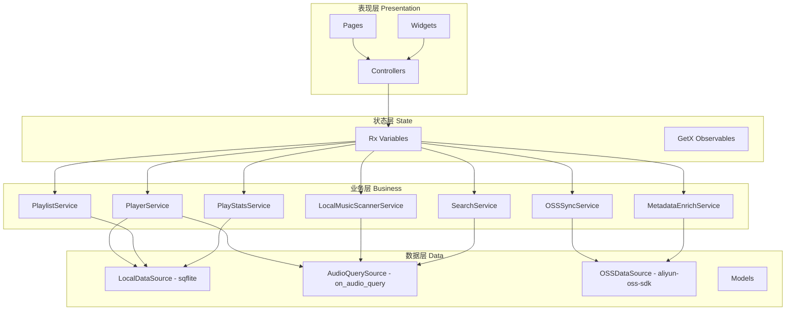

# Vexfy 系统架构文档

> ⚠️ v2 修订：删除 Online 模块（推荐/排行榜/歌单广场），与 PRD v2 保持一致。

## 1. 整体架构

Vexfy 采用**分层架构（Layered Architecture）**，自上而下分为四层：

```
┌─────────────────────────────────────────────┐
│          Presentation Layer（表现层）          │
│   Pages / Widgets / GetX Controllers        │
├─────────────────────────────────────────────┤
│          State Layer（状态层）                │
│   GetX Observable State / Rx Variables       │
├─────────────────────────────────────────────┤
│          Business Layer（业务层）              │
│   Services / Managers / Use Cases            │
├─────────────────────────────────────────────┤
│          Data Layer（数据层）                  │
│   Repositories / Data Sources / Models      │
└─────────────────────────────────────────────┘
```

## 2. 架构图（Mermaid）



## 3. 各层职责

### 表现层（Presentation Layer）

- 负责 UI 渲染和用户交互
- 使用 GetX Controller 绑定视图状态
- 直接依赖 Controller，不直接操作数据
- 目录：`lib/app/modules/`（按功能模块分）

### 状态层（State Layer）

- 管理响应式状态（Rx 变量）
- GetX Controller 中的 Observable 状态属于此层
- 负责状态变化的通知和分发
- 不包含业务逻辑，仅做状态容器

### 业务层（Business Layer）

- 封装具体业务逻辑（Services / Managers）
- 编排数据流，处理业务规则
- 为表现层提供业务接口
- 目录：`lib/app/services/` / `lib/app/managers/`

### 数据层（Data Layer）

- 统一管理本地和远程数据源
- Repository 模式解耦数据来源
- 处理数据模型与数据库/网络格式的转换
- 目录：`lib/app/data/`（providers / models / repositories）

## 4. 技术选型与架构决策

| 维度 | 选型 | 说明 |
|------|------|------|
| 状态管理 | GetX | 轻量，路由+状态+依赖注入一体化 |
| 本地数据库 | sqflite + path_provider | 结构化数据持久化 |
| 网络请求 | dio | 拦截器、重试、并发控制 |
| 播放器核心 | just_audio | 跨平台音频播放 |
| 后台播放 | audio_service + just_audio | Android/iOS 后台播放支持 |
| 本地音乐扫描 | on_audio_query | 查询设备音乐文件 |
| 路由管理 | GetX Route | 声明式路由 |
| OSS 同步 | aliyun_oss_flutter | 阿里云 OSS Flutter SDK |
| 元数据读写 | flutter_id3_reader | MP3 ID3v2 标签读写 |
| 缓存管理 | flutter_cache_manager | 音频文件缓存 |

## 5. 模块划分（v2）

> ⚠️ 与 PRD v2 一致：**删除 Online 模块**，新增 OSS Sync 模块和 Metadata Enrich 模块。

系统划分为 **6 个核心功能模块**：

| 模块 | 职责 | 依赖 |
|------|------|------|
| **Player** | 播放器核心，播放控制，队列管理，播放统计 | LocalMusic, Playlist |
| **LocalMusic** | 本地音乐扫描、浏览、文件元数据读取 | - |
| **Playlist** | 歌单创建、编辑、收藏、SQLite 持久化 | LocalMusic |
| **OSSSync** | 本地 ↔ OSS 双向同步，增量同步，冲突处理 | LocalMusic |
| **MetadataEnrich** | 封面/歌词自动补全，网络搜索 + ID3 嵌入 | LocalMusic |
| **Settings** | 应用设置（音质/倍速/分类管理/OSS配置） | OSSSync |

### 模块依赖关系图

```
Player ←─────────┐
               │
LocalMusic ────┼──→ Playlist
               │
OSSSync ←──────┤
               │
MetadataEnrich ←┘
               │
Settings ←─────┘
```

**依赖说明**：
- Player 依赖 LocalMusic（播放本地文件）和 Playlist（歌单播放）
- OSSSync 和 MetadataEnrich 都依赖 LocalMusic（扫描结果作为同步/补全对象）
- Settings 依赖 OSSSync（OSS 配置入口）

### 不存在的模块（已删除）

| 已删除模块 | 原因 |
|-----------|------|
| ~~Online~~ | PRD v2 删除了所有在线内容（推荐/排行榜/歌单广场），不再需要 |
| ~~RecommendService~~ | 依赖 Online 模块，一并删除 |
| ~~RankService~~ | 依赖 Online 模块，一并删除 |

## 6. 核心服务说明

### PlayerService
- 持有 `just_audio.AudioPlayer` 实例
- 管理播放状态：currentSong, isPlaying, position, duration
- 全局单例，通过 `Get.put()` 在 main.dart 初始化
- 组合 AudioHandlerService（后台播放）实现后台保活

### LocalMusicScannerService
- 调用 `on_audio_query` 扫描设备媒体库
- 按配置的同步目录递归扫描
- 生成文件哈希作为 songId
- 提供增量扫描（对比文件修改时间）

### OSSSyncService
- 管理 OSS 连接配置（AK/SK/Bucket/Endpoint）
- 维护本地文件元数据缓存（SQLite）
- 维护同步队列（待上传/待下载/同步失败）
- 增量同步策略：以文件修改时间戳判断新增/变更

### MetadataEnrichService
- 检测音频文件是否有封面/歌词
- 通过 QQ音乐 封面API 搜索封面
- 通过 QQ音乐 歌词API 搜索 LRC
- 使用 flutter_id3_reader 嵌入 ID3v2 标签（写前备份 .bak）

### PlayStatsService
- 异步批量写库（每 60s 一批）
- 内存缓存 + App 退出时 flush
- 时段统计：morning(6-12) / afternoon(12-18) / evening(18-24) / night(0-6)
- 最爱片段：30s 粒度，seek≥3 次触发

## 7. 数据库设计

- **song_stats**：歌曲播放统计（play_count / total_seconds / genre / favorite_time_slot / favorite_segment_start）
- **playlists**：歌单表
- **playlist_songs**：歌单歌曲关联表
- **local_file_metadata**：本地文件元数据缓存（用于 OSS 同步）
- **sync_queue**：同步任务队列

详见 `database-schema.md`。

## 8. 路由设计

| 路由 | 页面 | 说明 |
|------|------|------|
| `/` | SplashPage | 闪屏页 |
| `/guide` | GuidePage | 引导页 |
| `/home` | HomePage | 主页（含底部 4 Tab 导航） |
| `/player` | PlayerPage | 全屏播放器（从 Tab 1 跳转） |
| `/search` | SearchPage | 搜索页（Tab 2 内跳转） |
| `/playlist/:id` | PlaylistDetailPage | 歌单详情（Tab 2 内跳转） |
| `/stats-detail` | StatsDetailPage | 统计详情（Tab 3 内跳转） |
| `/settings/oss` | OSSSettingsPage | OSS 配置（Tab 4 内跳转） |

### 8.1 底部 Tab 导航结构

```
┌──────────────────────────────────────────────┐
│                  HomePage                     │
│  ┌────────────────────────────────────────┐  │
│  │          内容区域（Body）               │  │
│  │   Tab 1: PlayerPage                     │  │
│  │   Tab 2: PlaylistPage                   │  │
│  │   Tab 3: StatsPage                      │  │
│  │   Tab 4: SettingsPage                  │  │
│  └────────────────────────────────────────┘  │
│  ┌────────────────────────────────────────┐  │
│  │     全局迷你播放器（MiniPlayer）        │  │
│  │   （在所有 Tab 间常驻，切换时保持状态）   │  │
│  └────────────────────────────────────────┘  │
│  ┌────────────────────────────────────────┐  │
│  │       底部 Tab 导航栏（BottomNavBar）    │  │
│  │   [播放器] [播放列表] [统计] [设置]       │  │
│  └────────────────────────────────────────┘  │
└──────────────────────────────────────────────┘
```

### 8.2 全局组件

| 组件 | 层级 | 说明 |
|------|------|------|
| **MiniPlayer** | 全局覆盖层 | 底部常驻，播放时显示，点击展开全屏播放器 |
| **NotificationPlayer** | 系统通知栏 | 锁屏/切 App 继续播放，控制：上一首/播放暂停/下一首 |

### 8.3 Tab 与模块对应关系

| Tab | 页面 | 对应业务模块 |
|-----|------|-------------|
| Tab 1 | PlayerPage | PlayerService（播放控制）、MetadataEnrichService（歌词/封面） |
| Tab 2 | PlaylistPage | LocalMusicScannerService（本地扫描）、PlaylistService（歌单管理） |
| Tab 3 | StatsPage | PlayStatsService（统计聚合） |
| Tab 4 | SettingsPage | SettingsService（配置）、OSSSyncService（OSS同步） |

---

---

_最后更新: 2026-05-11 v3（更新为 4 Tab 底部导航结构，全局迷你播放器组件）_
